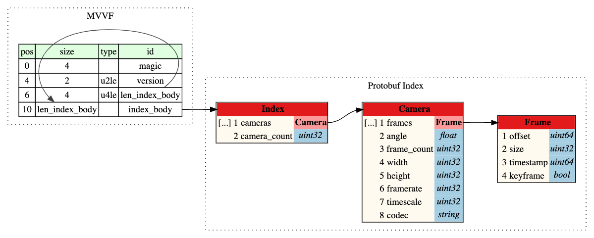

# Multi Viewpoint Plauer

A hackathon project to build a demo player to support multi-viewpoint playback.

## Project Objective

Build a demo web player like that.

## Collect Video Resource

I don't have many cameras at home. So I tried to record 20 seconds of content from Youku to simulate nine cameras shooting the same content from different angles.

The recorded videos are encoded in AV1 and saved in IVF containers. Using IVF instead of MP4 containers could simplify the remux step to save time for the hackathon.

All videos are encoded in 24 fps with forced GOP at every second. So there will be a keyframe every 24 frames. All media source files are saved in `media_sources` folder.

## New Media Container Format

The current media container formats like MP4, MKV, or other formats are not efficient for indexing multi-camera streams. We need to locate any camera at a specific position lightning fast to provide a smooth user experience. We also need to store all video frames in a more compact way to save bandwidth and decrease the latency when switching cameras.

Then I will design a new media container and implement the muxer and demuxer. To save time for the hackathon, I plan to use `Protobuf` to serialize the frame indexes and use `Kaitai Struct` to simplify the binary format definition.

File structure is defined in [file_structure.ksy](./container_design/file_structure.ksy) and media index is defined in [media_index.proto](container_design/media_index.proto). I used [kaitai-struct-compiler](https://kaitai.io/) and [protodot](https://github.com/seamia/protodot) to generate the Graphviz dot files and then join them together.

## Muxer

I plan to use Golang to implement the Muxer because we could get the (IVF parserhttps://github.com/pion/webrtc/blob/master/pkg/media/ivfreader/ivfreader.go)[https://github.com/pion/webrtc/blob/master/pkg/media/ivfreader/ivfreader.go] for free from the WebRTC project.
